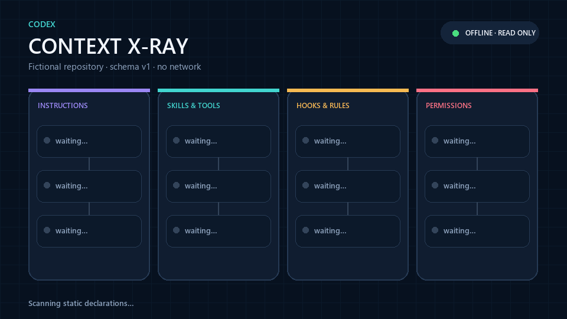

<div align="center">

# Codex Context X-Ray

**在 Codex 开始工作前，看清它会加载什么、覆盖什么、忽略什么，以及什么仍取决于条件。**

[](https://github.com/yuansays/codex-context-xray/actions/workflows/ci.yml)
[](https://github.com/yuansays/codex-context-xray/releases)
[](LICENSE)

[English](README.md) · [查看演示](#十秒看懂) · [安全边界](#x-ray-永远不会展示什么)



</div>

Codex 可能从多个作用域继承指令、配置、Skills、MCP、hooks、rules 和权限。
当一层覆盖另一层、项目因未受信任而被跳过，或指令链碰到字节上限时，只看文件
往往很难解释最终结果。

`codex-xray` 在本地重建这条加载链，并把它变成可点击的因果图。它不会让模型去
猜两段自然语言是否“冲突”，只报告确定的加载、优先级、校验与安全条件。

## 十秒看懂

```console
$ codex-xray demo
Codex Context X-Ray 0.1.0
Result: warning | Sources: 17 (active=9, shadowed=1, conditional=2, ignored=2, unobserved=3)
Findings: 5 (warning=4, info=1)
Coverage: mode=offline-static, target=./apps/orbit, repository_root=.,
          user_config=not requested, trust=trusted, network=not used,
          unobserved=5 areas

Findings
- [WARNING] Hook representations are merged (HOOKS_MIXED_REPRESENTATIONS): ...
- [WARNING] Legacy sandbox disables permission profiles (PERMISSIONS_LEGACY_CONFLICT): ...
- [WARNING] Prefix rules overlap (RULES_OVERLAP): ...
- [WARNING] Duplicate Skill name (SKILL_DUPLICATE_NAME): ...
- [INFO] MCP server is defined in multiple layers (MCP_SERVER_OVERRIDE): ...
```

上面的输出就来自内置演示，数据全部虚构：

```bash
codex-xray demo --open
```

## 安装

需要 Python 3.10 或更新版本。v0.1 通过固定 Git 标签和 GitHub Release 分发，
暂不发布到 PyPI。

```bash
# 1. 安装固定版本
pipx install "git+https://github.com/yuansays/codex-context-xray.git@v0.1.0"

# 2. 进入要检查的仓库
cd your-project

# 3. 生成并打开单文件报告
codex-xray scan . --format html --output codex-xray.html --open
```

使用 `uv`：

```bash
uv tool install "git+https://github.com/yuansays/codex-context-xray.git@v0.1.0"
```

每个 Release 还会提供 wheel、源码包和 `SHA256SUMS`。

## 命令

```text
codex-xray scan [TARGET]
  [--include-user]
  [--profile NAME]
  [--trust auto|trusted|untrusted]
  [-c KEY=VALUE ...]
  [--format human|json|html]
  [--output PATH]
  [--open]
  [--fail-on never|warning|error]

codex-xray demo [--open]
codex-xray explain <RULE_ID>
```

`TARGET` 可以是文件或目录，它决定从仓库根到目标位置的指令与配置链。默认 human
格式输出到终端；JSON 默认写到 stdout；HTML 必须指定 `--output`，或使用
`--open` 写入临时目录后打开。

只有你明确传入 `--include-user` 时，工具才会加入用户级指令、配置、Skills、
hooks 和 rules。默认扫描不会访问主目录。

CI 示例：

```bash
codex-xray scan . --trust trusted --format json \
  --output codex-xray.json --fail-on error
```

退出码稳定：

| 代码 | 含义 |
|---:|---|
| `0` | 没有达到 `--fail-on` 阈值 |
| `1` | 有 finding 达到失败阈值 |
| `2` | 请求、解析或运行失败 |

## v0.1 能看懂什么

| 区域 | 复现的 Codex 行为 | 输出 |
|---|---|---|
| Instructions | `AGENTS.override.md`、`AGENTS.md`、fallback、根到目标顺序、字节预算 | 生效链、遮蔽和截断 |
| Configuration | 用户/profile/项目/CLI 优先级、嵌套项目层、信任、项目禁改键 | 带来源的最终值 |
| Skills | 仓库与显式用户发现、frontmatter、重名、启停声明 | 可用与条件状态 |
| MCP | 同名覆盖、enabled/required、工具 allow/deny、审批 | 最终 server 声明 |
| Hooks | `hooks.json`、内联 hooks、功能开关、信任、同层合并 | 合并后的生命周期声明 |
| Rules | 静态 Starlark `prefix_rule`、重叠、最严格决策 | `forbidden > prompt > allow` |
| Permissions | 旧 sandbox 与 permission profile、继承、文件/网络声明 | 最终模式与冲突 |

适配逻辑固定到明确的[官方行为契约](docs/ADAPTER_CONTRACT.md)，Codex 文档变化也能像
代码变化一样审查。

## 报告长什么样

HTML 是单文件，不使用 CDN、统计、服务端或远程字体，分成四条轨道：

1. **Instructions**：哪些指令文件进入上下文，字节预算在哪里停止。
2. **Skills & Tools**：Skills 与 MCP 的重名、覆盖和触发条件。
3. **Hooks & Rules**：合并后的 hooks 和确定性的命令策略结果。
4. **Permissions**：最终选择的 sandbox 或权限 profile，以及原因。

点击节点可以查看来源、状态、优先级、原因和脱敏后的安全摘录。JSON 使用稳定的
`schema_version: 1`，顶层字段固定为 `coverage`、`layers`、`sources`、
`effective_state`、`findings` 和 `redactions`。

## 隐私设计

- 默认只读仓库、完全离线、零遥测。
- 只有明确传入 `--include-user` 才读取用户范围。
- 永不把 `auth.json`、会话、日志、SQLite、浏览器数据或环境变量值作为输入。
- 永不启动 hooks、MCP、插件、模型或仓库代码。
- 主目录显示为 `$HOME`；凭据、私钥、签名查询参数、敏感 header 与命令参数都会脱敏。
- 逃出仓库或显式用户根目录的符号链接/Junction 只报告，不跟随。

### X-Ray 永远不会展示什么

X-Ray 看不到隐藏系统提示、实时对话上下文、云端下发策略和仅运行时存在的插件内容；
也不声称理解任意自然语言冲突。这些区域会明确显示为 `unobserved` 或
`conditional`，不会制造确定性。

本项目与 OpenAI 没有隶属或背书关系；“Codex”仅用于描述配置格式兼容性。

## 为什么不做通用上下文检查器

[CtxGov](https://github.com/ctxgov/ctxgov) 等工具面向更广的 Agent 上下文治理。
X-Ray 刻意保持窄而深：复现 Codex 已公开的加载规则，再用可点击的本地报告解释因果。
因此不需要用 AI 语义打分，也能回答具体的“为什么”。

## 开发

```bash
python -m venv .venv
.venv/Scripts/python -m pip install -e ".[dev]"  # Windows
# .venv/bin/python -m pip install -e ".[dev]"   # macOS/Linux
pytest
ruff check .
mypy src
python -m build
```

夹具与隐私要求见 [CONTRIBUTING.md](CONTRIBUTING.md)。欢迎提交兼容性样例和 bug。

## 许可证

MIT © 2026 Yuan Says AI。
